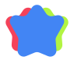

# Активиста

  

## Девиз/слоган проекта

«Лучшее мироустройство»

## Добро пожаловать

Цель проекта — разработать систему для сотрудничества (далее Система), способную делать жизнь людей более эффективной, благодаря замене рутинных процессов по организации своей деятельности на более актуальные.

## Результаты достижения цели

1. Самореализация человека
2. Образование человека
3. Персональный помощник в ведении здорового образа жизни
4. Инструмент тайм-менеджмента
5. Платформа для создания некоммерческих проектов
6. Платформа для межкомандного взаимодействия

## Технические требования

На данный момент [технические требования](./technical_requirements.md) в разработке.

## Участие в проекте

Этот проект использует [C4(Collective Code Construction Contract)](./C4.ru.md).
